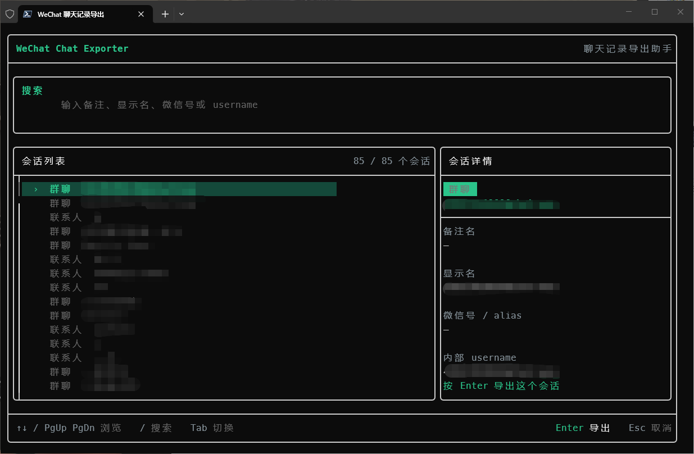

# WeChatCopilot

面向 Windows 微信 4.x 的本地研究工具集，提供数据库只读浏览、按会话导出，以及
WCDB 密钥捕获实验。项目不修改微信数据库，所有真实数据库、密钥和导出物都应留在
`local-data/` 或其他被版本控制排除的位置。

> 密钥捕获入口已适配 Windows 微信 `4.1.12.26` 和 `4.1.13.12`，插件会按实际
> `Weixin.dll` 文件版本选择 RVA 并校验入口签名。逆向参考中的其他函数地址、数据结构、
> 数据库参数和表结构仍以 `4.1.12.26` 为基线，升级后不能直接复用。

## 功能

| 目标 | 作用 | 入口 |
|---|---|---|
| `db_explorer` | 浏览本地 WCDB 数据库、查询表和导出 Schema | `http://127.0.0.1:8090` |
| `chat_exporter` | 按联系人或群聊导出消息及关联数据 | 命令行 |
| `chat_launcher` | 启动微信并注入密钥捕获插件 | 命令行 |
| `chat_plugin` | 捕获 WCDB key，并仅通过本机端口提供结果 | `http://127.0.0.1:6500` |

## 构建

要求 Windows、Visual Studio C++ 工具链、CMake 和 xmake。首次构建先准备固定版本的
WCDB 子模块：

```powershell
git submodule update --init --recursive
cmake -S .deps/wcdb/src -B .deps/wcdb/src/build -A x64 -DWCDB_CPP=ON -DWCDB_ZSTD=ON
cmake --build .deps/wcdb/src/build --config Release --parallel
xmake f -m release
xmake
```

依赖关系、单目标构建和注入组件说明见 [开发指南](docs/DEVELOPMENT.md)。

## 浏览数据库

先关闭微信并复制完整的 `db_storage`；如果数据库仍在 WAL 模式，快照必须包含同一时刻
的 `.db`、`.db-wal` 和 `.db-shm`。

```powershell
$env:WECHAT_DB_KEY_HEX = '<64 位十六进制 WCDB key>'
$env:WECHAT_DB_DIR = (Resolve-Path '.\local-data\db-storage').Path
xmake run db_explorer
```

打开 `http://127.0.0.1:8090`。数据库关系、加密参数、消息分表和压缩规则见
[数据库指南](docs/DATABASES.md)。

## 导出会话

先通过 `chat_launcher` 启动微信并让插件捕获 key，再把完整数据库快照放到程序工作目录的
`db_storage/` 下。`chat_exporter` 只接收账号数据根目录，并在其中自动找到数据库目录；
启动后会列出存在消息表的联系人和群聊：

```powershell
xmake run chat_exporter -- 'C:\Users\Administrator\Documents\xwechat_files\wxid_xxx_0000'
```

控制台使用全屏交互界面，可实时搜索备注、显示名、微信号或内部用户名，并在右侧查看
联系人详情；选中会话后按 `Enter` 开始导出。结果写入同一 `db-storage/` 下的独立时间戳
目录，只包含消息 JSONL 和 manifest；可关联的图片、语音、
视频及文件信息会嵌入消息。目录布局、选择方式和字段说明见
[聊天导出器](docs/CHAT_EXPORTER.md)。

## 文档

- [开发指南](docs/DEVELOPMENT.md)：目录、构建、运行、HTTP API、密钥捕获组件和验证。
- [数据库指南](docs/DATABASES.md)：WCDB/SQLCipher、快照、核心表、跨库关系和 Schema 更新。
- [聊天导出器](docs/CHAT_EXPORTER.md)：当前 `chat_exporter` 的完整行为。
- [逆向参考](docs/REVERSE_ENGINEERING.md)：版本化 RVA、对象布局、证据和未完成项。
- [Schema 索引](docs/ai/DATABASE_SCHEMA.md)：从本机快照生成的紧凑表结构索引；精确数据见
  [database_schema.json](docs/ai/database_schema.json)。

## 数据与安全边界

- 所有数据库连接必须保持只读；不要在运行中的微信数据库上试验写入。
- 数字 ID 和 `rowid` 只在所属数据库内有效，跨库关联先还原为 `username`。
- 不提交 key、聊天正文、账号标识、原始数据库、WAL/SHM、日志或导出物。
- `chat_plugin` 会把 key 暂存在微信进程内存并暴露给本机端口，只应在受控环境使用。
- 字段名推测不是事实；未经过样本或调用链验证的语义必须标为推测或未知。

## 使用

```powershell
.\chat_launcher.exe '\xxxx\Weixin.exe'   # 运行密钥捕获程序，会自动拉起微信，登陆完成再执行导出程序
.\chat_exporter.exe 'C:\Users\xxxx\Documents\xwechat_files\wxid_xxxx'   # 导出指定账号的聊天记录
```

## 软件界面



## 待做事项

- [ ] 图片、视频、语音和文件等消息的完整导出，当前只嵌入关联信息。
- [ ] 导出格式整理，当前只输出原始 JSONL，且没有对消息正文、时间戳、发送者和接收者做统一处理。

## 免责声明

仅用于本地研究和学习，禁止用于任何商业或非法用途。请遵守当地法律法规，保护个人隐私和数据安全。